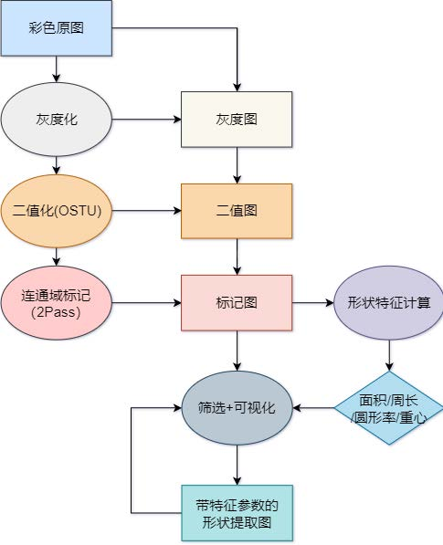
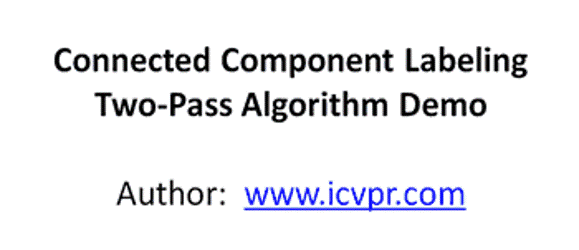
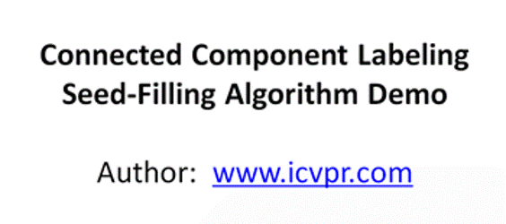
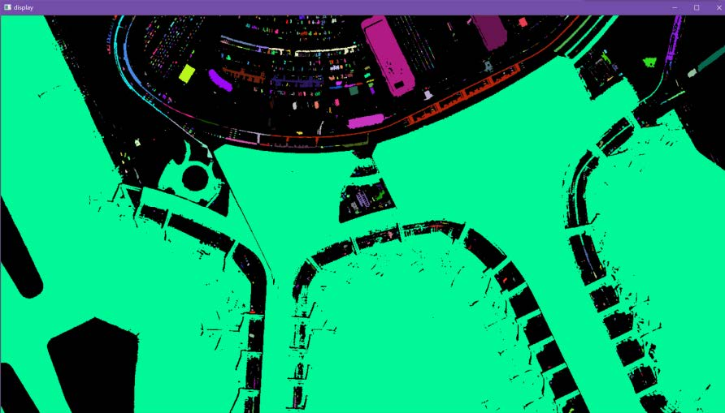

# Shape-Feature
### `【武汉大学遥感学院】数字图像处理实习 |  图像连通域提取与形状特征分析`  
 [ShapeFeatures.cpp](./ShapeFeatures.cpp) **核心代码**
## 设计思路
  

## 辅助算法
- 图像灰度化   
    >最大值法
- 图像二值化  
    >状态法  
    >最大类间差法
## 核心算法
- 图像连通域标记
    >两次扫描法  
    >  
    >种子填充法  
    >
- 图像特征计算
    >轮廓特征：周长、圆形度  
    >区域特征：面积、重心
## 测试界面
- **_取不同的形状面积阈值_**  
   
- **_高分遥感影像_**   
 
